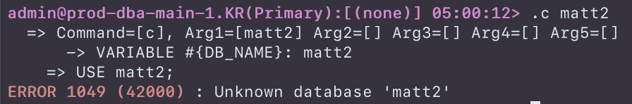
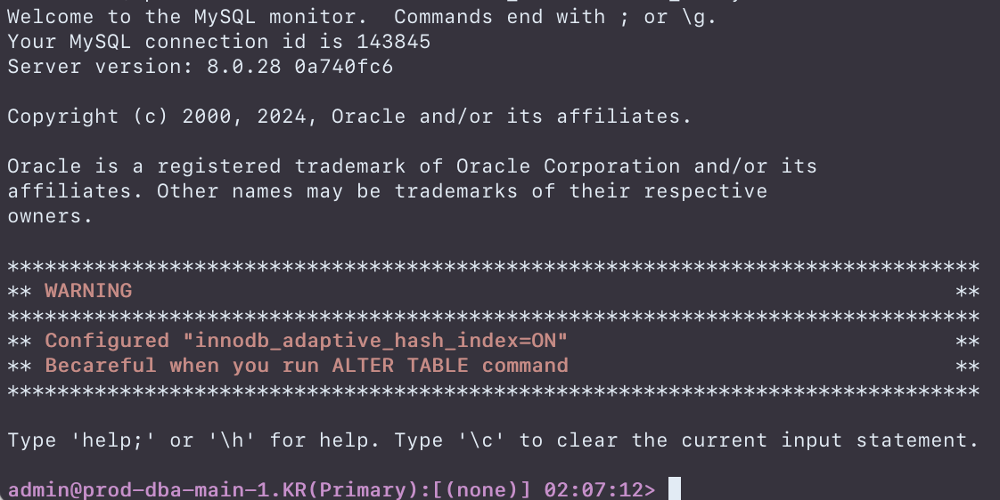

# MySQL Rich Client
&nbsp;
&nbsp;
## Command Line Interface Prompt Change
&nbsp;
### Prompt for Aurora MySQL (`~/.my.cnf`)
```
## \\X : Aurora Hostname + Region(abbr)
## \\Z : Aurora Replication role
prompt="\\u@\\X(\\Z):[\\d] \\R:\\m:\\s\\T>"
```

##### Writer DB Prompt
```
admin@prod-dba-main-1.KR(Primary):[(newworld)] 06:04:46>
```

##### Reader DB Prompt
```
admin@prod-dba-main-0.KR(Replica):[(newworld)] 06:05:21>
```

### Change Color of prompt (`~/.my.cnf`)
`prompt_color_primary` 와 `prompt_color_replica`는 별도로 설정되지 않으면, `magenta`와 `blue`로 초기 설정된다.
```
## black | red | green | yellow | blue | magenta | cyan | white
prompt_color_primary=magenta
prompt_color_replica=blue
```


&nbsp;
&nbsp;
## Error Message Color
`error_code_color` 는 별도로 설정되지 않으면, `red`로 초기 설정된다.
```
## black | red | green | yellow | blue | magenta | cyan | white
error_code_color=red
```

&nbsp;
&nbsp;
## Warning for AdaptiveHashIndex
MySQL 서버의 `innodb_adpative_hash_index` 시스템 변수가 `on`으로 설정되어 있는 경우, 로그인시에 경고 메시지 출력한다.

&nbsp;
&nbsp;
## Run SQL File
MySQL prompt에서 지정된 Prefix (`.`)를 사용하면, 등록된 단축 명령을 실행할 수 있다.
&nbsp;
### 단축 명령 등록
`~/.mysqlrc/` 디렉토리에 `.sql` 확장자를 가진 SQL 파일 생성한다.
SQL 파일은 반드시 아래 규칙을 준수해야 한다.
#### 첫번째 라인은 반드시 명령어 도움말이 표시되어야 한다. (예시 참고)
```
## [Transaction List] 트랜잭션 목록 조회 - ARGS( ${THRESHOLD_SECONDS} )
```
* SQL 파일의 첫번째 줄은 순수하게 사용자의 편의를 위한 부분임
* 쿼리 실행시에 전혀 사용되지 않음
* 설명의 제일 앞쪽에는 검색을 위한 키워드 목록을 영어로 입력
* 마지막 부분에는 쿼리 실행에 필요한 Argument를 `ARGS`로 표시

#### 두번째 라인부터는 실행할 SQL 명령을 입력한다.
* 쿼리가 사용자 변수를 필요로 하는 경우 `${VAR_NAME}` 형태를 사용
* 쿼리가 시스템 변수를 필요로 하는 경우 `#{VAR_MAME}` 형태를 사용
  - 현재는 `#{CURRENT_DB}`, `#{CURRENT_USER}`, `#{CURRENT_HOST}` 만 지원
* 쿼리는 반드시 `\G` 또는 `;`로만 종료되어야 함
```sql
## [Transaction List] 트랜잭션 목록 조회 - ARGS( ${THRESHOLD_SECONDS} )
SELECT tx.trx_state, tx.trx_mysql_thread_id,
  (unix_timestamp(now()) - unix_timestamp(tx.trx_started)) as elapsed,
  IFNULL(th.processlist_command,'Unknown') as command,
  IFNULL(th.processlist_info, tx.trx_query) as last_query_of_trx,
  th.PROCESSLIST_ID, th.PROCESSLIST_USER, th.PROCESSLIST_HOST
FROM information_schema.innodb_trx tx
  LEFT JOIN performance_schema.threads th ON th.processlist_id=tx.trx_mysql_thread_id
WHERE tx.trx_state IN ('RUNNING', 'LOCK WAIT', 'ROLLING BACK', 'COMMITTING')
  AND (unix_timestamp(now()) - unix_timestamp(tx.trx_started))>=${THRESHOLD_SECONDS}
ORDER BY tx.trx_started ASC;
```

#### SQL 파일의 Argument 사용시 주의사항
* Argument는 문자열 또는 숫자 값 구분없이 모두 그대로 대치된다.
* 문자열 처리는 SQL 파일내에서 따옴표를 먼저 입력해두어야 한다. (e.g. `'${VAR_NAME}'`)
* Argument 값은 공백 또는 따옴표 사용시 Escape 처리를 하지 않는다.
* 하나의 SQL 파일에서 Argument는 최대 5개까지만 사용 가능하다.

#### 단축 명령 네이밍 규칙
* `객체 + 오퍼레이션`의 조합 형태로 단축어 생성(e.g. `"TABLE LIST" => tl.sql`, `"TABLE CREATE" => t.sql`)
* 더 자세한 명령 또는 Argument가 필요한 복잡한 명령에는 `+` 표시 사용 (e.g. `"SHOW PROCESSLIST" => ps.sql`, `"SHOW FULL PROCESSLIST" => ps+.sql`)
&nbsp;
### 단축 명령 목록 조회
등록된 단축 명령 목록은 지정된 Prefix `.`만 입력하거나, 또는 `.?`를 입력하면 된다.

#### 모든 단축 명령 조회
```
admin@prod-dba-main-0.KR(Replica):[(none)] 06:29:27> .?
    ----------------------------------------------
        => c        : ## [Change Database] 데이터베이스 이동  - ARGS( ${DB_NAME} )
        => connhost : ## [User Client Host] 클라이언트 호스트별 컨넥션 개수
        => connuser : ## [User Connection] 사용자별 컨넥션 개수
        => d        : ## [Database Create] 데이터베이스 상세 정보 조회 - ARGS( ${DB_NAME} )
        => dl       : ## [Database List] 데이터베이스 목록 조회
        => f        : ## [Function Create] 함수 상세 정보 조회 - ARGS( ${FUNCTION_NAME} )
        => fl       : ## [Function List] 함수 목록 조회
        => lock     : ## [Lock Transaction List] 잠금 목록 조회
        => p        : ## [Procedure Create] 프로시져 상세 정보 조회 - ARGS( ${PROCEDURE_NAME} )
        => pl       : ## [Procedure List] 프로시져 목록 조회
        => ps+      : ## [Full Processlist]  프로세스 목록 조회
        => ps       : ## [Processlist]  프로세스 목록 조회
        => s+       : ## [Show Status] 시스템 상태 값 조회 - ARGS( ${STATUS_NAME} )
        => s        : ## [Show Status] 시스템 상태 값 조회
        => t        : ## [Table Create] 테이블 상세 정보 조회 - ARGS( ${TABLE_NAME} )
        => tg       : ## [Trigger Create] 프로시져 상세 정보 조회 - ARGS( ${TRIGGER_NAME} )
        => tgl      : ## [Trigger List] 트리거 목록 조회
        => ti       : ## 테이블의 인덱스 목록 조회 - ARGS( ${TABLE_NAME} )
        => tl       : ## [Table List] 테이블 목록 조회
        => tx+      : ## [Transaction List] 트랜잭션 목록 조회 - ARGS( ${THRESHOLD_SECONDS} )
        => tx       : ## [Transaction List] 트랜잭션 목록 조회
        => uc       : ## [User Create] 사용자 생성 정보 조회 - ARGS( ${USER_NAME}} )
        => ug       : ## [User Grant Privileges] 사용자 권한 정보 조회 - ARGS( ${USER_NAME}} )
        => ul+      : ## [User List] 사용자 목록 조회 (시스템 계정 포함)
        => ul       : ## [User List] 사용자 목록 조회 (시스템 계정 제외)
        => v+       : ## [Show Variable] 시스템 변수 조회 - ARGS( ${VARIABLE_NAME} )
        => v        : ## [Show Variable] 시스템 변수 조회
    ----------------------------------------------
    => 27 custom commands found
```

#### 단축 명령 검색
필요한 단축 명령만 검색하고자 할 때에는 `.` 또는 `.?` 뒤에 공백과 함께 키워드를 입력한다.
```
admin@prod-dba-main-0.KR(Replica):[(none)] 06:32:18> .? table
    ----------------------------------------------
        => t        : ## [Table Create] 테이블 상세 정보 조회 - ARGS( ${TABLE_NAME} )
        => ti       : ## 테이블의 인덱스 목록 조회 - ARGS( ${TABLE_NAME} )
        => tl       : ## [Table List] 테이블 목록 조회
    ----------------------------------------------
    => 3 custom commands found
```
&nbsp;
### 단축 명령 사용
등록된 단축 명령 실행은, 
아래와 예시와 같이 지정된 Prefix인 `.`과 SQL 파일명 (확장자 제외)을 공백없이 입력하면 된다.
```
admin@prod-dba-main-0.KR(Replica):[(none)] 06:29:25> .dl
    => Command=[dl], Arg1=[] Arg2=[] Arg3=[] Arg4=[] Arg5=[]
    => SELECT TABLE_SCHEMA, COUNT(*) as TABLES, SUM(DATA_LENGTH/1024/1024/1024) as DATA_LENGTH_GB, SUM(INDEX_LENGTH/1024/1024/1024) as DATA_LENGTH_GB
    => FROM INFORMATION_SCHEMA.TABLES
    => GROUP BY TABLE_SCHEMA
    => ORDER BY TABLE_SCHEMA;
+--------------------+--------+----------------+----------------+
| TABLE_SCHEMA       | TABLES | DATA_LENGTH_GB | DATA_LENGTH_GB |
+--------------------+--------+----------------+----------------+
| conan              |     20 | 0.001770019530 | 0.001068115231 |
| information_schema |     89 | 0.000000000000 | 0.000000000000 |
| lake               |      1 | 0.000015258789 | 0.000000000000 |
| matt               |     18 | 0.000518798826 | 0.000152587890 |
| mysql              |     51 | 0.007583618162 | 0.000320434570 |
| performance_schema |    113 | 0.000000000000 | 0.000000000000 |
| silver             |     14 | 4.557418823244 | 1.280319213867 |
| sys                |    101 | 0.000015258789 | 0.000000000000 |
| test               |     10 | 3.907852172850 | 0.000000000000 |
+--------------------+--------+----------------+----------------+
```
&nbsp;
### 단축 명령 사용 (with Argument)
Argument를 필요로 하는 SQL 파일의 실행은 2가지 방법으로 실행할 수 있다.

#### Argument 입력 프롬프트 활용
```
admin@prod-dba-main-0.KR(Replica):[matt] 06:34:10> .t
    => Command=[t], Arg1=[] Arg2=[] Arg3=[] Arg4=[] Arg5=[]
  > parameter #{TABLE_NAME}: t1
    => SHOW CREATE TABLE t1 ;
*************************** 1. row ***************************
       Table: t1
Create Table: CREATE TABLE `t1` (
  `id` int DEFAULT NULL,
  `year_col` int DEFAULT NULL
) ENGINE=InnoDB DEFAULT CHARSET=utf8mb4 COLLATE=utf8mb4_0900_ai_ci
/*!50100 PARTITION BY RANGE (`year_col`)
(PARTITION p1 VALUES LESS THAN (1995) ENGINE = InnoDB,
 PARTITION p2 VALUES LESS THAN (1999) ENGINE = InnoDB,
 PARTITION p3 VALUES LESS THAN (2003) ENGINE = InnoDB,
 PARTITION p4 VALUES LESS THAN (2007) ENGINE = InnoDB,
 PARTITION p5 VALUES LESS THAN (2024) ENGINE = InnoDB) */
1 row in set (0.01 sec)
```

#### Argument를 단축 명령과 같이 입력
```
admin@prod-dba-main-0.KR(Replica):[matt] 06:34:45> .t t1
    => Command=[t], Arg1=[t1] Arg2=[] Arg3=[] Arg4=[] Arg5=[]
    => SHOW CREATE TABLE t1 ;
*************************** 1. row ***************************
       Table: t1
Create Table: CREATE TABLE `t1` (
  `id` int DEFAULT NULL,
  `year_col` int DEFAULT NULL
) ENGINE=InnoDB DEFAULT CHARSET=utf8mb4 COLLATE=utf8mb4_0900_ai_ci
/*!50100 PARTITION BY RANGE (`year_col`)
(PARTITION p1 VALUES LESS THAN (1995) ENGINE = InnoDB,
 PARTITION p2 VALUES LESS THAN (1999) ENGINE = InnoDB,
 PARTITION p3 VALUES LESS THAN (2003) ENGINE = InnoDB,
 PARTITION p4 VALUES LESS THAN (2007) ENGINE = InnoDB,
 PARTITION p5 VALUES LESS THAN (2024) ENGINE = InnoDB) */
1 row in set (0.00 sec)
```

&nbsp;
### 단축 명령 목록
단축 명령의 자세한 예제들은 [client/mysqlrc 디렉토리](https://github.com/sunguck/mysql-server/tree/matt/mysql-rich-client-8.0.40/client) 참고
